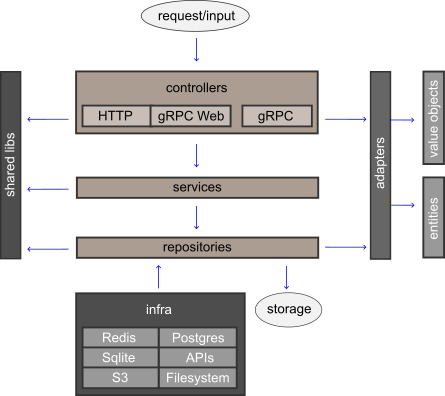

# Go para API Rest e gRPC server

## Índice

- [Tecnologias](#tecnologias)
- [Arquitetura](#arquitetura)
- [Estrutura de pastas e diretórios](#estrutura-de-pastas-e-diretórios)
- [Como funciona?](#como-funciona)
- [Convenções](#convenções)
- [Novo projeto](#novo-projeto)
- [Como contribuir?](#como-contribuir)


## Arquitetura



Arquitetura de software é uma estrutura que suporta os casos de uso do projeto
com o objetivo de facilitar a manutenção do código.
A arquitetura criada aqui foi inspirada em Clean Architecture e Domain-Driven
Design (DDD). As seguintes premissas foram adotadas:

- Independência de Frameworks
- Fácil de testar
- Estrutura de dados flexível
- Injeção de dependência
- Encapsulamento de bibliotecas externas
- Agilidade na mudança de banco de dados

As decisões para alcançar as premissas foram:

- Entities representam estrutura de dados do domínio da aplicação e regras de negócio
- Value Objects são estruturas de dados simples que trafegam entre as camadas até serem convertidos de/para entities
- Repositories armazenam e recuperam informações do sistema
- Services contém as regras de negócio e atuam orquestrando entities e repositories
- Adapters convertem uma estrutura de dados para outra que seja mais coeso para utilização nos services
- Infra é a camada para utilização de recursos externos como rede e armazenamento
- Controllers orquestram o fluxo da aplicação desde a entrada de dados até a saída deles
- Suporte a múltiplos databases


## Estrutura de pastas e diretórios

```
.
├── cmd/                               # The entrypoint where main.go lives
│   ├── server/
│   │   ├── main.go
├── src/
│   ├── application/
│   │   ├── application.go             # Inject dependencies and start all servers
│   │   ├── server/                    # Server interface for HTTP, gRPC and gRPC Web
│   │   ├── httpserver/                # HTTP Server for RESTFul APIs
│   │   │   ├── router/                # Routes definitions
│   │   │   └── controllers/           # Handle requests and responses
│   │   ├── grpcwebserver/             # gRPC Web server over the HTTP server
│   │   │   └── controllers/           # Handle requests and responses
│   │   └── grpcserver/                # gRPC Server
│   │   │   └── controllers/           # Handle requests and responses
│   ├── shared/                        # Utilities that could be used by any layers
│   ├── infra/                         # Usage for network communication and storage
│   ├── interfaces/                    # Go interfaces
│   ├── adapters/                      # Convert data from/to the format most convenient for the use cases and entities
│   ├── controllers/                   # Handle the application flows
│   ├── services/                      # Application logics for business scenarios
│   ├── valueobjects/                  # Structs for data input/output
│   ├── repositories/                  # Store and recover data from outside world
│   ├── proto/                         # Stubs generated by protoc compiler
│   └── entities/                      # A data structure that represents business and its rules
├── assets/                            
│   ├── static/                        # Static files will be embed and served via /static endpoint
│   │   └── proto/                     # Protocol buffer definitions source files
│   └── web/                           # HTML files will be embed and renderized by HTTP server
├── sdk/                               # SDK for clients
├── scripts/                           # Shell scripts for dev/devops needs
├── migrations/                        # History of database changes and initial data
├── .editorconfig                      # Editor config
├── .gitignore                         # GIT ignore paths
├── config.local.yaml                  # Config file for local development
├── config.test.yaml                   # Config file for testing
└── README.md                          # Initial documentation
```

## Como funciona?

### Tecnologias

#### Echo Framework

Echo é uma framework para desenvolvimento web que facilita a criação de APIs
Rest e renderização de templates HTML.  Suas principais características são:

- Router otimizado com zero alocação de memória dinâmica Organização de APIs em grupos
- Suporte a HTTP/2 Fácil de adicionar middlewares Data binding para o payload de request HTTP
- Renderização de templates

#### gRPC (Google Remote Procedure Call)

O gRPC é um protocolo de comunicação criado pelo Google no qual serviços
distribuídos podem se comunicar sem necessidade de entendimento da camada de
rede.  Os dados são transmitidos pela rede em formato binário, diferente do
HTTP que utiliza texto puro.  

Esse protocolo utiliza o modelo client/server. O desenvolvedor especifica em um
arquivo texto, utilizando uma sintaxe chamada Protobuf, quais serviços serão
expostos no server.  O arquivo deve ser disponibilizado para que outros
desenvolvedores possam utilizar o compilador `protoc` para ler essas definições
e criar um **stub** para a linguagem de programação utilizada pelo client.  Por
fim, o client só precisa importar o stub como uma biblioteca de terceiros e
invocar as funções dos serviços expostos pelo server.

#### gRPC Web

O gRPC Web é uma implementação Javascript de gRPC client para browsers.  Ele é
totalmente compatível com gRPC servers rodando em Go. Para outras linguagens é
necessário adicionar o proxy Envoy para traduzir a requisição enviada do
browser antes de encaminha-la para o server.

Basta importar os stubs gerados para Javascript e chamar as respectivas funções
de acordo com o serviço exposto. O gRPC Web converte os dados para binário e
envia usando HTTP POST. O server em Go roda um servidor HTTP que intercepta as
requisições desse tipo e trata como requisições gRPC.

Exemplo de um arquivo com definições de serviços escrito em Protobuf:

```proto
syntax = "proto3";

package private;
option go_package = "proto";

service AccountService {
    rpc Create(User) returns (User) {}
    rpc AuthenticateByEmailAndPassword(User) returns (Account) {}
}

message User {
    string email = 1;
    string password = 2;
}

message Account {
    string token = 1;
}
```

### Arquitetura

Fluxo dos dados:

1. O controller recebe o input de dados. Deve existir controllers diferentes para cada tipo, HTTP, gRPC e gRPC Web
2. O controller utiliza o Adapter para converter a estrutura de dados, que pode ser VO ou Protobuf, para entity
3. O controller envia a Entity para o Service que pode ou não ter alguma regra de negócio
4. O Service altera a Entity, se necessário, e encaminha para o Repository
5. O Repository armazena ou recupera os dados a partir de um database ou API externa

## Convenções

As principais convenções adotadas foram:

- Structs Container que possuem os services e repositories injetados
- Nome de arquivos possuem o sufixo de acordo com seu tipo. Ex.: `TodoService.go` para um service
- Arquivos de testes com sufixo `_test` no nome do arquivo e no package, localizados no mesmo diretório das implementações
- Configuração via arquivo YAML por ambiente
- Suporte a múltiplos banco de dados Customização de erros para facilitar o retorno dos status code do HTTP e gRPC

## Novo projeto

### Primeiros passos

Clone o repositório desse exemplo, substitua `gustavohenrique/{{ .ProjectName }}` pelo
nome real da empresa e projeto.

```sh
git clone <{{ .ProjectName }}>
cd {{ .ProjectName }}
sed -i 's+'gustavohenrique/{{ .ProjectName }}'+'minhaempresa/meuprojeto'+g' *          # Linux
# sed -i '' 's,'gustavohenrique/{{ .ProjectName }}','gustavohenrique/meuprojeto',g' *  # MacOS

make setup
make sqlite
make proto
make lint
make test
make run
```

## Como contribuir?

1. Abra uma issue para discutir sua proposta de mudança e se ela será aceita
2. Faça um fork desse repositório se sua mudança for aceita
3. Crie um feature branch: `git checkout -b my-new-feature`
4. Faça um commit e push das suas mudanças: `git commit -am 'Add some feature' && git push origin my-new-feature`
5. Crie um pull request
