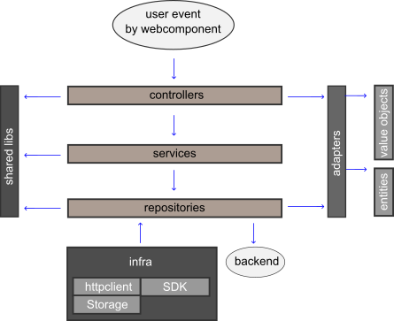

# VueJS + Quasar Single Page Application

## Índice

- [Quasar Framework](#quasar-framework)
- [Arquitetura](#arquitetura)
- [Estrutura de pastas e diretórios](#estrutura-de-pastas-e-diretórios)
- [Como funciona?](#como-funciona)
- [Convenções](#convenções)
- [Novo projeto](#novo-projeto)
- [Como contribuir?](#como-contribuir)

## Quasar Framework

VueJS é uma biblioteca Javascript que auxilia o desenvolvimento de interfaces
web gráficas interativas. É uma tecnologia que possui curva de aprendizado
baixa, quando comparada à outras soluções populares, como AngularJS e ReactJS.

Quasar é um framework baseado em VueJS com uma grande quantidade de componentes
customizáveis e bem documentos, fornecendo agilidade e beleza para
desenvolvimento de interfaces ricas.

Principais vantagens:

- Servidor de desenvolvimento bem rápido
- Atualizações frequentes
- Build mais rápido
- Geração de SPA, PWA e SSR
- Documentação clara fornecendo exemplos
- Customização simples de temas e aparência
- Comunidade colaborativa e bem ativa

Um SPA é um aplicativo que funciona dentro do navegador e não exige que a página seja recarregada por completa durante seu uso.
O uso de SPA deve ser adotado para projetos que não precisam ser indexados por motores de busca.

## Arquitetura

Arquitetura de software é uma estrutura que suporta os casos de uso do projeto com o objetivo de facilitar a manutenção do código.
A arquitetura criada aqui foi inspirada em Clean Architecture e Domain-Driven Design (DDD). As seguintes premissas foram adotadas:

- Independência de Frameworks
- Fácil de testar
- Estrutura de dados flexível
- Injeção de dependência
- Encapsulamento de bibliotecas externas
- Internacionalização com suporte a múltiplos idiomas

As decisões para alcançar as premissas foram:

- Entities representam estrutura de dados do domínio da aplicação e regras de negócio
- Repositories armazenam e recuperam informações do sistema
- Uses cases são as funcionalidades da aplicação e atuam orquestrando entities e repositories
- Adapters convertem uma estrutura de dados para outra que seja mais coeso para utilização nos uses cases
- Infra é a camada para utilização de recursos externos como rede e armazenamento
- Controllers manipulam eventos de components, utilizando adapters para converter os dados para os uses cases
- Components são injetados automaticamente e devem lidar apenas com captura e apresentação da informação
- Shared libs devem ser encapsuladas
- Bus funciona como pub/sub global para comunicação entre componentes Vue
- Suporte a múltiplos idiomas utilizando uma pasta para cada um

## Estrutura de pastas e diretórios

```
.
├── src/
│   ├── boot/                # Boot files (app initialization code)
│   ├── router/              # Vue Router
│   ├── layouts/             # Layout .vue files
│   ├── pages/               # Page .vue files used in routes
│   ├── components/          # Components used in pages and/or layouts
│   ├── stores/              # A store contain data that can be accessed throughout your components
│   ├── assets/              # Dynamic assets (processed by webpack)
│   ├── css/                 # CSS files for your app
│   ├── App.vue              # Root Vue component of your App
│   ├── index.template.html  # Template for index.html
│   └── application/         # The application's core
│       ├── shared/          # Encapsulates third party libs
│       ├── infra/           # Usage for network communication and storage
│       ├── locales/         # Language definitions
│       ├── adapters/        # Convert data from/to the format most convenient for the use cases and entities
│       ├── controllers/     # Handle user events
│       ├── services/        # Application logics for business scenarios
│       ├── repositories/    # Store and recover data from outside world
│       └── entities/        # A data structure that represents business and its rules
├── package.json             # npm scripts and dependencies
├── quasar.conf.js           # Quasar App Config file
├── babel.config.js          # Babeljs config
├── jest/                    # Global beforeEach used by tests
├── jest.config.js           # Test's configuration
├── dist/spa                 # Where production builds go
├── .editorconfig            # Editor config
├── .eslintignore            # ESlint ignore paths
├── .eslintrc.js             # ESlint config
├── .postcssrc.js            # PostCSS config
├── .stylintrc               # Stylus lint config
├── .gitignore               # GIT ignore paths
└── README.md                # Initial documentation
```

## Como funciona?

### Tecnologias

- **Pinia**: gerencia o estado global de um objeto. Quando o valor dele é
- alterado, todos os componentes com referência ao objeto são atualizados
- automaticamente com o novo valor. **Vue Router**: gerencia as rotas da
- aplicação, permitindo executar funções antes ou depois de cada transição de
- rota. **Jest**: suíte de testes.

### VueJS

Arquivos com a extensão .vue podem conter múltiplas seções: template (HTML),
script (Javascript) e style (CSS ou SCSS). O style definido é aplicado apenas
ao template do mesmo arquivo, de forma isolada do restante da aplicação. As
variáveis no template são delimitadas por duplas chaves. Elas são reativas e
exibem automaticamente os valores alterados via Javascript.

```vue
<template>
  <div>
    <div class="hello">
      Olá, {{ name }}! Como está? {{ answer }}
    </div>
    <button @click="answerTheQuestion" />
  </div>
</template>
<script>
export default {
  data () {
    return {
      name: 'GoCache Dev',
      answer: ''
    }
  },
  methods: {
    answerTheQuestion () {
      this.answer = 'Estou bem, obrigado!'
    }
  }
}
</script>
<style>
.hello {
  font-size: 16px;
  color: blue;
}
</style>
```

### Arquitetura



O Quasar obtém as configurações do arquivo `quasar.conf.js` no momento da
inicialização. Esse arquivo possui um array chamado boot contendo o nome dos
arquivos que estão dentro da pasta `src/boot` e serão executados na
inicialização.

O que exite em boot está fazendo injeção de código no contexto do Vue. Assim é
possível, por exemplo, criar um componente na pasta `src/components` e ele
estará disponível, sem precisar importá-lo manualmente.

Em seguida, a página da rota default é renderizada. Essa rota está configurada
no arquivo `src/router/route.js` e possui Layout e Page definidos. Pages são
componentes renderizados a cada mudança de rota. As páginas precisam estar
dentro de um componente de nível maior, o Layout. Um caso de uso comum é
utilizar 2 layouts, um para páginas públicas e outro para páginas que apenas
usuários autenticados podem acessar.

As pages contém os componentes interativos. Esses componentes se comunicam com
os controllers para processar os eventos do usuário. O controller utiliza os
adapters para converter um objeto Javascript do Vue para uma entity utilizada
pela aplicação. Essa estrutura é enviada para o use case e depois para
comunicação com o backend.

Tal como os componentes, os controllers também são injetados no contexto do
Vue. Assim, é possível invocá-los a partir de qualquer componente Vue. A
vantagem de utilizar controllers ao invés de adicionar lógicas em funções
dentro do próprio componenente, é a facilidade de testar, sem precisar
renderizar o componente durante a execução dos testes, aumentando a velocidade.

Os use cases são injetados nos controllers, ficando disponíveis sem necessidade
de importação e permitindo o uso de mocks durante os testes unitários.

### Testes automatizados

Essa arquitetura considera dois tipos de testes: unitários e de componentes. Os
testes unitários permitem que seja testado o que uma função recebe e retorna
como parâmetro. O testes de componentes são para verificar o comportamento de
um componente Vue de acordo com um determinado valor. Exemplos desse tipo de
teste são verificar os parâmetros recebidos por uma função quando o usuário
clicar em um botão e ocultar um texto de acordo com o valor de uma variável.

O testes ficam dentro de uma pasta `__tests__` no mesmo nível do código a ser
testado. A convenção adotada aqui foi a extensão de arquivo `*.spec.js` para
testes de componentes Vue e `*.test.js` para os unitários.

Os testes podem ser executados via comando `npm test` e será exibido um
relatório de cobertura ao final. O arquivo `jest.config.js` contém as
configurações para rodar os testes e nele é possível definir um threshold
indicando qual o nível de cobertura aceitável.

## Convenções

As principais convenções adotadas foram:

- Dependências injetadas recebem o prefixo `$`. Ex.: `$crypto`;
- Nome de arquivos possuem o sufixo de acordo com seu tipo. Ex.: `userEntity.js` para um entity User;
- Arquivos de testes de componentes recebem a extensão `.spec.js` e os demais `.test.js`; Entities possuem getters e setters.

## Novo projeto

### Primeiros passos

Instale o Quasar Framework globalmente e depois as dependências do projeto.

```sh
npm i -g @quasar/cli
npm install
npm test
npm start
```

### Autenticação

O projeto possui uma página para autenticação que deve ser modificada conforme
as regras do novo projeto. Nesse exemplo, o processo de autenticação verifica
se o email existe, obtendo os dados do usuário como nome e data de criação da
conta. Se existir, exibe o campo de senha e verifica se email e senha estão
corretos. Caso o email não exista, solicita uma senha, efetua o cadastro e
autentica o usuário.

As seguintes premissas foram adotadas para fortalecer a segurança:

- O serviço que verifica se o email existe deve retornar apenas o ID, email, nome, picture, createdAt e publicKey;
- É gerado um hash da senha usando o algorítimo PBKDF2. Esse hash é criptografado utilizando a publicKey e codificado como base64 para ser enviado na rede;
- O par de chaves RSA, privateKey e publicKey, é gerado no momento do cadastro e enviados para armazenamento no serviço;
- A criptografia utiliza a tecnologia WebCrypto presente nos browsers modernos e não depende de bibliotecas de terceiros.

### Adicionando caso de uso

Um fluxo completo pode ser:

- Criar uma página Vue em `src/pages`, extendida de um layout para usuários autenticados ou não;
- Adicionar componentes do Quasar nessa página ou criar outros componentes em `src/components`, caso seja utilizado em outras páginas;
- Criar um controller, entity, adapter, repository e use case para lidar com os dados;
- Externalizar textos e palavras de acordo com o idioma em `src/application/locales`;
- Escrever testes quando o componente ou função tiver alguma lógica.

## Como contribuir?

1. Abra uma issue para discutir sua proposta de mudança e se ela será aceita
2. Faça um fork desse repositório se sua mudança for aceita
3. Crie um feature branch: `git checkout -b my-new-feature`
4. Faça um commit e push das suas mudanças: `git commit -am 'Add some feature' && git push origin my-new-feature`
5. Crie um pull request
